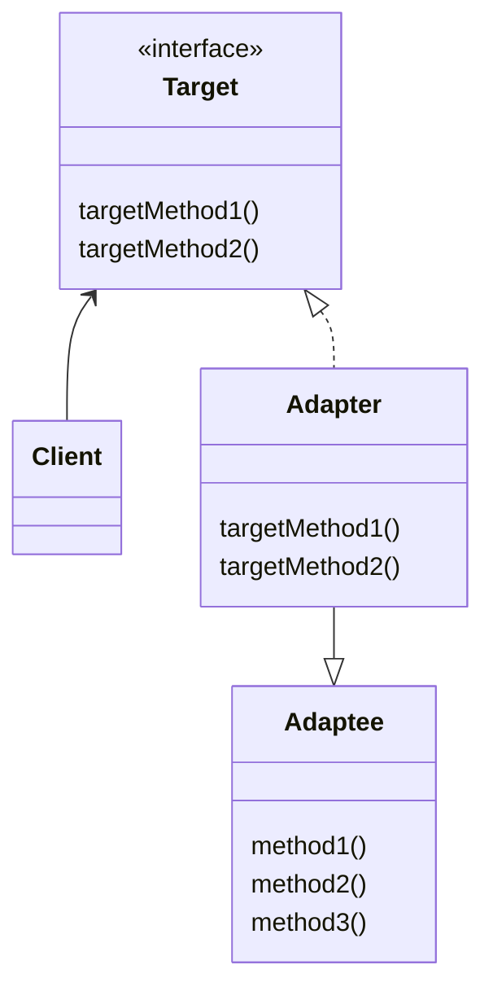
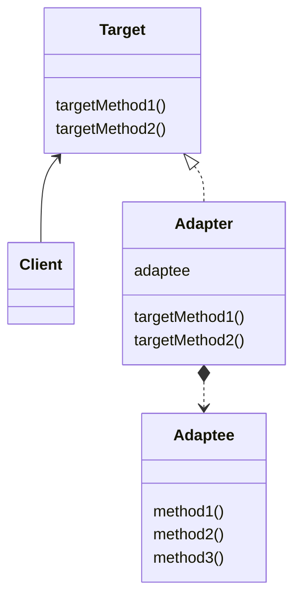

## 🎯 사이에 끼워 재사용한다

---

### class Adapter

```mermaid
   classDiagram
      
    class Client {
        
    }
    Target <-- Client
    Target <|.. Adapter

    class Target {
        <<interface>>
        targetMethod1()
        targetMethod2()
    }

    class Adapter {
        targetMethod1()
        targetMethod2()
    }

    Adapter --|> Adaptee

    class Adaptee {
        method1()
        method2()
        method3()
    }
```

---

### method Adapter

```mermaid
classDiagram
    Target <-- Client
    Target <|.. Adapter
    Adapter *..> Adaptee
    
    class Client {
        
    }
    
    class Target {
        targetMethod1()
        targetMethod2()
    }
    
    class Adapter {
        adaptee
        targetMethod1()
        targetMethod2()
    }
    
    class Adaptee {
        method1()
        method2()
        method3()
    }
        
```

