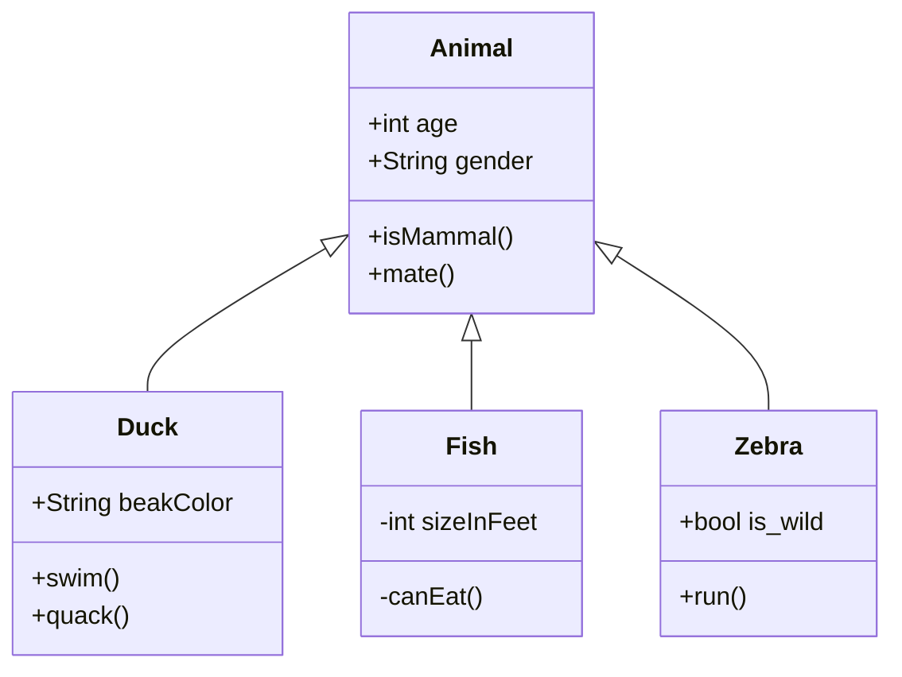
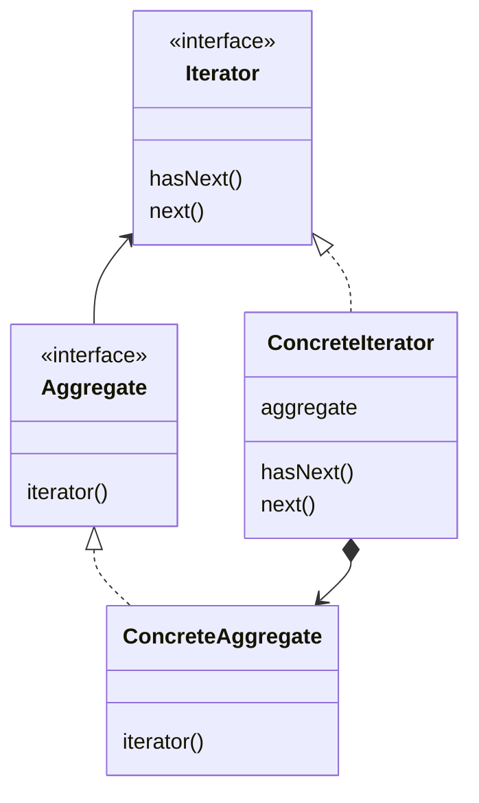
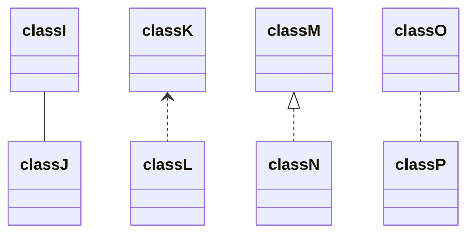
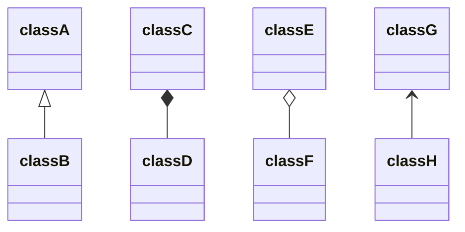

## 🎯 처리를 반복한다.

---

 
 
 
 

| 이름                | 설명                                                             |
|-------------------|----------------------------------------------------------------|
| Iterable\<E>      | 집합체를 나타내는 인터페이스(java.lang 패키지) 예제 Iterable<Book>           |
| Iterator\<E>      | 처리를 반복하는 반복자를 나타내는 인터페이스 (java.lang 패키지) 예제 Iterator<Book> |
| Book              | 책을 나타내는 클래스                                                    |
| BookShelf         | 책장을 나타내는 클래스                                                   |
| BookShelfIterator | 책장을 검색하는 클래스                                                   |

 
 
 
 

### Iterator (반복자)
- 타입, 요소, API 결정
- hasNext(), next()

### Concretelterator (구체적인 반복자)
- Iterator 가 결정한 API 를 실제 구현
- Iterator 실제 구현체 
- ex.BookShelfIterator

### Aggregate (집합체)
- Iterator 를 만들어 내는 API
- '내가 가진 요소를 차례로 검색해 주는 역할'

### ConcreteAggregate (구체적인 집합체)
- Aggregate 가 결정한 API 를 실제 구현
- 구체적인 Iterator 역할.
- Concretelterator 의 인스턴스를 만들어 낸다
- ex) BooksShelf

