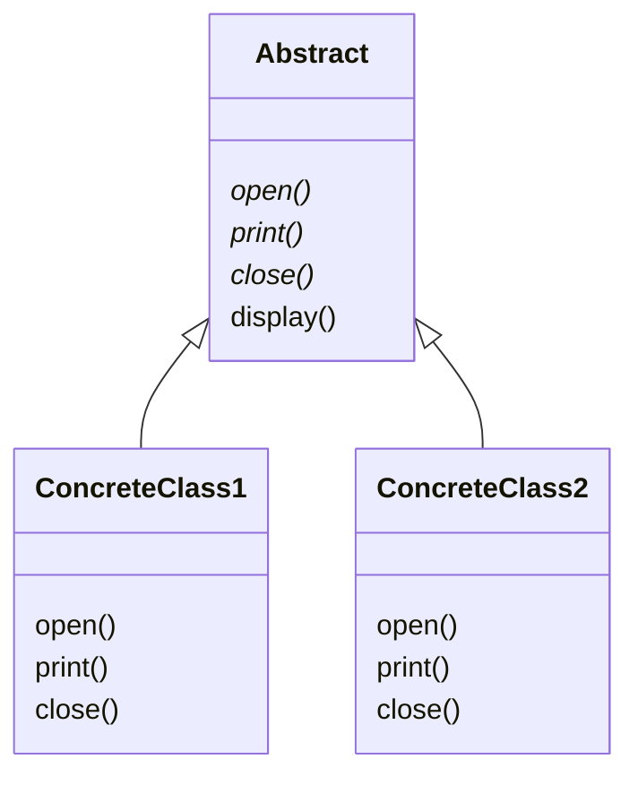
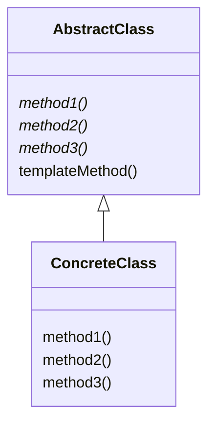

## 🎯하위 클래스에서 구체적으로 처리한다

---

```mermaid
   classDiagram

    Abstract <|-- ConcreteClass1
    Abstract <|-- ConcreteClass2

    class Abstract {
        open()*
        print()*
        close()*
        display()
    }

    class ConcreteClass1 {
        open()
        print()
        close()
    }

    class ConcreteClass2 {
        open()
        print()
        close()
    }
```

```mermaid
   classDiagram
       
   AbstractClass <|-- ConcreteClass
   
    class AbstractClass {
        method1()*
        method2()*
        method3()*
        templateMethod()
    }

    class ConcreteClass {
        method1()
        method2()
        method3()
    }
```